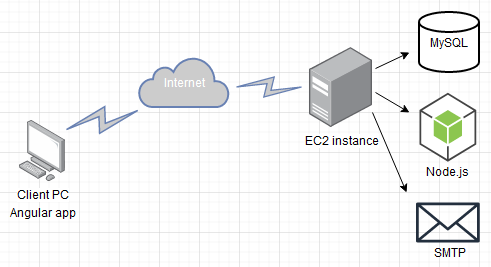
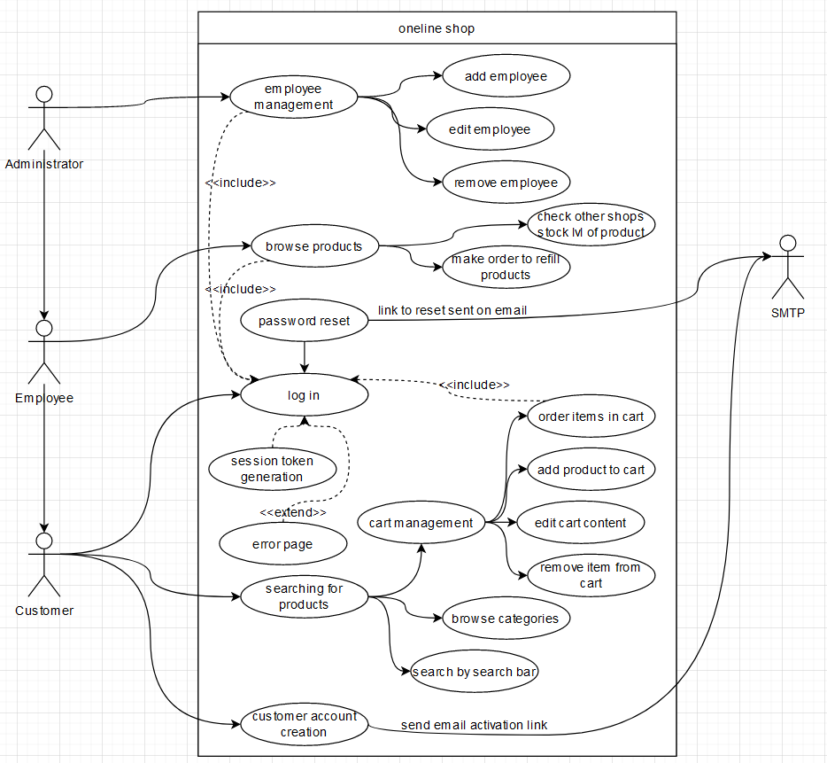

# Online Shop

- [Introduction](#Introduction)
- [Architecture](#Architecture)
- [Functionality](#Functionality)
- [Team](#team)

## Introduction

----

The main goal of this project is to practice and gain experience while colllaborating with others programmers on GitHub. Technologies that are used in this project are not known for any of users that are starting this project - we wanted to challenge ourselfs a little bit.  
This repository is going to focus on as much utilization of GitHub features as we could.

### Objectives of the project

1. Main goal of the project is to learn new technologies
2. The idea of project came up when two strangers found each others on GitHub - they need to collaborate to provide good quality project
3. Technologies used in this project are 'something new' for collaborators - it is pushing them to learn new things 
4. Project will take adventages of CI (Continuous Itegration) and there's plan to deploy it on EC2 Instance or Docker container

## Architecture
---

|  |
| :----------------------------------------------------: |
|           _System architecture in overwiev_            |

#### Technolgies planned for use

|         [Node.js](https://nodejs.org/en/)         |          [Angular](https://angular.io/)           |        [MySQL](https://www.mysql.com/)        |
| :-----------------------------------------------: | :-----------------------------------------------: | :-------------------------------------------: |
|  |  |  |

## Functionality

---

|  |
| :--------------------------------------------: |
|             _Use-case UML diagram_             |

This application is going to have definied 3 roles in database:

 - **Customer** - customer account is the most restricted account type in this application. Customer is able to execute actions like searching for products, look inside categories, manage his own cart and buy stuff. Some actions require log in to access for ex. logged customer is able to buy stuff othwerwise he is able only to manage is cart and browse products,
 - **Employee** - will be priviledged to see how many products are available in store and order products for restock,
 - **Administrator** - this account type is able to do everything that employee is able to do. In addition administrators will be able to manage of employees.

Application will have definied SMTP server to send account creation confirmation links or reseting passwords via email.

## Team

|          | Jhosef Cardich | Paweł Siwoń                             |
| -------- | ----------------------------- | --------------------------------------- |
| Git      | [@JhosefCardich](https://github.com/JhosefCardich)            | [@siwonpawel](https://github.com/siwonpawel)                           |
| Twitter  | [link](https://twitter.com/jhosefcardich)                              | [link](https://twitter.com/siwonpawel)  |
| Facebook |                               | [link](https://facebook.com/siwonpawel) |

---
